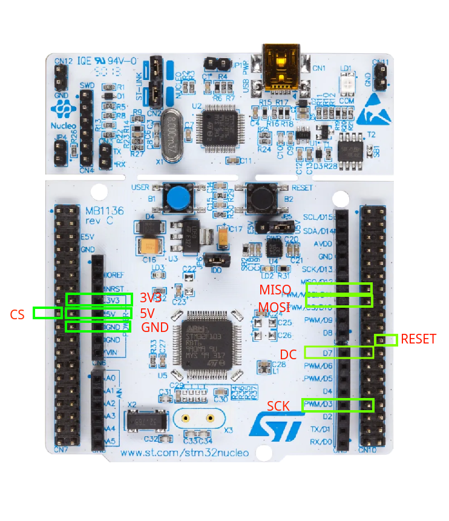

# Using ILI9341 screen with STM32F070RB

## Wiring

| Screen Pin | Nucleo Pin |   Nucleo Name   |         Description         |
|:----------:|:----------:|:---------------:|:---------------------------:|
|    VCC     |   CN7-18   |       5V        |    Main supply (3.3V-5V)    |
|    GND     |   CN7-20   |       GND       |             GND             |
|     CS     |   CN7-17   |  PA15 (Output)  |         Chip Select         |
|   RESET    |  CN10-22   |  PB2 (Output)   |        Screen Reset         |
|     DC     |  CN10-23   |  PA8 (Output)   |   Data/Command Selection    |
| SDI(MOSI)  |  CN10-15   | PA7 (SPI1_MOSI) |  Master Output Slave Input  |
|    SCK     |  CN10-31   | PB3 (SPI1_SCK)  |          SPI Clock          |
|    LED     |   CN7-16   |      3.3V       | Screen Backlight (3.3V Max) |
| SDO(MISO)  |  CN10-13   | PA6(SPI1_MISO)  | Screen Backlight (3.3V Max) |

